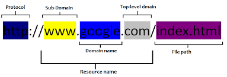

## HTTP
The Hypertext Transfer Protocol (HTTP) is the mechanism through which data is requested and provided on the World Wide Web.

When sending an API request, we use a URL to identify the specific server where we want to send the request (kind of like the address on an envelope) and the rest of the url specifies what it is we want the server to send back. These are called parameters or queries.

The image below labels the parts of a url. DNS uses the resource name to look up the server to which the request is addressed. Anything beyond the resource name is part of the query or filepath the specifies exactly what data or resources are being requested.

  

### Other transfer protocols
There are many other communication protocols, including FTP (file transfer protocol), SMTP (Simple Mail Transfer Protocol) and IMAP (Internet Message Access Protocol).   

HTTPS and FTPS are secure versions of HTTP and FTP. They use SSL (Secure Sockets Layer), which encrypts the request and response. There is a close analogy between protocols and programming languages: protocols are to communications what programming languages are to computations.

### HTTP methods
#### GET

This is, funnily enough, used to 'get' or retrieve resources such as HTML, JavaScript, CSS, images and so on. As a general rule, `GET` requests should not modify the resource in any way.

#### POST

The `POST` method is used to send data to the server. The resource at the path specified in the request will deal with the data. The data is sent in the body of the request with the encoding method specified in an additional header called `Content-Type` so that the server knows how to decode the information. A `Content-Length` header is also required so that the server knows when it has received all of the information (a large amount of data might be split across multiple requests).

#### PUT

`PUT` places some provided data at the exact path specified in the request. If something already exists at that path the server will replace whatever is there.

Note the distinction between `PUT` and `POST`: with `POST` the path specified in the request will handle the data and the server can put the data where it likes. A `PUT` request is basically a request to update the resource at the specified path with the data provided.

#### DELETE

An obvious one - the client has requested the server to delete the resource at the path specified.

### HTTP status codes
Status codes accompany a server response to indicate whether the request was successful. They are made up of a three-digit number and a human-readable phrase, eg `200 OK`. There are many status codes, and you don't need to memorise them, but it is useful to know the main groups.

#### Codes starting with 1
These are known as 'informational' codes, indicating that the request was received and a provisional response has been supplied.

**100 Continue**  
The server has received and approved the request headers and is giving permission to the client to send the request body. This is useful when the client wants to post a large amount of data.

**101 Switching Protocols**  
The requester has asked the server to switch protocols and the server has agreed to do so

#### Codes starting with 2
These are success codes, indicating that the request was received and correctly processed.

**200 OK**  
All is well. If a resource was requested it will be provided.

#### Codes starting with 3

These indicate some kind of redirection.

#### Codes starting with 4

These codes indicate some kind of error with the request.

**404 Not Found**  
The famous one! The client has requested a resource that the server doesn't know how to find.

#### Codes starting with 5

This group of responses indicates an error with the server.
